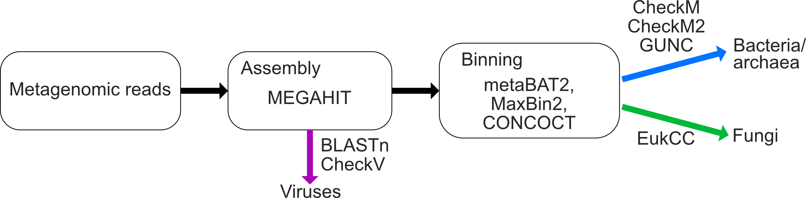

# ELSG - Early-Life Skin Genome Catalog
The Early-Life Skin Genomes (ELSG) catalog comprises 9,483 prokaryotic genomes from 1,056 species, 206 fungal genomes from 13 species, and 39 eukaryotic viral sequences. This genome catalog substantially expands the diversity of species previously known to comprise human skin microbiome and improves the classification rate of sequenced data by 21%. This GitHub repository contains codes utilized in the ELSG study and organized in the form of Snakemake pipelines. 

